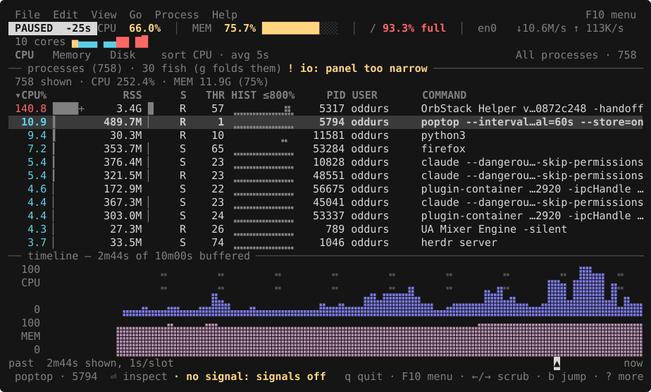

# poptop

A system monitor you can rewind, with nothing to set up first.

[](https://github.com/oddurs/poptop/actions/workflows/ci.yml)
[](Cargo.toml)
[](docs/reference/platforms.md)
[](LICENSE)

poptop keeps every sample it takes — including the full process table — so you can
scrub backwards and ask what was eating the box forty seconds ago. It starts
with an empty buffer and fills it as it runs: no daemon, no config, no logfiles,
nothing that had to be running before you noticed the problem.



A real frame, rendered from a terminal capture by
[`tools/screenshot.py`](tools/screenshot.py) — not a drawing, and not
retouched: a ten-core workstation with 801 processes on it, running a dozen
compressors and a checksum, scrubbed back forty seconds to a busy moment.
`PAUSED −40s` and the `▲` under the graphs are the cursor; sampling carried on
behind it. `30 fish (g folds them)` is poptop noticing that one program is
crowding the table. `████+` is a process past one core.

The bar names every command; the strip under the header belongs to the table
and says which resource, how the rows are arranged, and which rows they are;
the graphs sit under the table because they are how it got there.

<details>
<summary>A paused frame, as text — the timeline scrubbed back eighteen seconds</summary>

```
 File  Edit  View  Go  Process  Help                                 F10 menu
 PAUSED  -18s CPU  89.2%  │  MEM  50.0% ██████▒▒░░░░   SWP  50.0%
  4 cores ▇▄▁█
 CPU   Memory   Disk    sort CPU · avg 5s            All processes · 4 · root
── processes (4) · all root ! io: panel too narrow ───────────────────────────
 4 shown · CPU 105.2% · MEM 704.0M (4%) · 4 threads
 ▾CPU%            RSS      S   THR HIST ≤100%     PID COMMAND
  54.0 ██▏     512.0M ▏    S     1 ⠀⣿⣇⣸⣿⣀⣿⣇⣸⣿     824 postgres
   7.6 ▎        32.0M      S     1 ⠀⣀⣀⣀⣀⣀⣀⣀⣀⣀    1190 nginx
   2.6 ▏       148.0M      S     1 ⠀⣀⣀⣀⣀⣀⣀⣀⣀⣀    2077 node
   0.1          12.0M      S     1 ⠀⣀⣀⣀⣀⣀⣀⣀⣀⣀       1 systemd


── timeline — 4m59s of 9m59s buffered ────────────────────────────────────────
  100 ⣀⠀⣶⣶⣶⣶⣶⣶⣶⣶⣶⣶⠀⠀⣀⠀⠀⠀⠀⠀⠀⣀⣶⣶⣶⣶⣶⣶⣶⣶⣶⣶⠀⠀⠀⣀⠀⠀⠀⠀⠀⠀⣶⣶⣶⣶⣶⣶⣶⣶⣶⣶⠀⠀⠀⠀⣀⠀⠀⠀⠀⠀⣶⣶⣶⣶⣶⣶⣶⣶⣶⣶
  CPU ⣀⠀⣿⣿⣿⣿⣿⣿⣿⣿⣿⣿⠀⠀⣀⠀⠀⠀⠀⠀⠀⣀⣿⣿⣿⣿⣿⣿⣿⣿⣿⣿⠀⠀⠀⣀⠀⠀⠀⠀⠀⠀⣿⣿⣿⣿⣿⣿⣿⣿⣿⣿⠀⠀⠀⠀⣀⠀⠀⠀⠀⠀⣿⣿⣿⣿⣿⣿⣿⣿⣿⣿
      ⠀⠀⣿⣿⣿⣿⣿⣿⣿⣿⣿⣿⠀⠀⠀⠀⠀⠀⠀⠀⠀⠀⣿⣿⣿⣿⣿⣿⣿⣿⣿⣿⠀⠀⠀⠀⠀⠀⠀⠀⠀⠀⣿⣿⣿⣿⣿⣿⣿⣿⣿⣿⠀⠀⠀⠀⠀⠀⠀⠀⠀⠀⣿⣿⣿⣿⣿⣿⣿⣿⣿⣿
    0 ⣤⣤⣿⣿⣿⣿⣿⣿⣿⣿⣿⣿⣤⣤⣤⣤⣤⣤⣤⣤⣤⣤⣿⣿⣿⣿⣿⣿⣿⣿⣿⣿⣤⣤⣤⣤⣤⣤⣤⣤⣤⣤⣿⣿⣿⣿⣿⣿⣿⣿⣿⣿⣤⣤⣤⣤⣤⣤⣤⣤⣤⣤⣿⣿⣿⣿⣿⣿⣿⣿⣿⣿
  100 ⠤⠀⠀⠀⠀⠀⠀⠤⠀⠀⠀⠀⠀⠀⠤⠀⠀⠀⠀⠀⠀⠤⠀⠀⠀⠀⠀⠀⠤⠀⠀⠀⠀⠀⠀⠤⠀⠀⠀⠀⠀⠀⠤⠀⠀⠀⠀⠀⠀⠤⠀⠀⠀⠀⠀⠀⠤⠀⠀⠀⠀⠀⠀⠤⠀⠀⠀⠀⠀⠀⠤⠀
  MEM ⣤⣤⣤⣤⣤⣤⣤⣤⣤⣤⣤⣤⣤⣤⣤⣤⣤⣤⣤⣤⣤⣤⣤⣤⣤⣤⣤⣤⣤⣤⣤⣤⣤⣤⣤⣤⣤⣤⣤⣤⣤⣤⣤⣤⣤⣤⣤⣤⣤⣤⣤⣤⣤⣤⣤⣤⣤⣤⣤⣤⣤⣤⣤⣤⣤⣤⣤⣤⣤⣤⣤⣤
    0 ⣿⣿⣿⣿⣿⣿⣿⣿⣿⣿⣿⣿⣿⣿⣿⣿⣿⣿⣿⣿⣿⣿⣿⣿⣿⣿⣿⣿⣿⣿⣿⣿⣿⣿⣿⣿⣿⣿⣿⣿⣿⣿⣿⣿⣿⣿⣿⣿⣿⣿⣿⣿⣿⣿⣿⣿⣿⣿⣿⣿⣿⣿⣿⣿⣿⣿⣿⣿⣿⣿⣿⣿
past  2m23s shown, 1s/slot                                          ▲      now
q quit · F10 menu · ←/→ scrub · b jump · +/- zoom · Space live · ? more
```

Top to bottom: the menu bar, which names every command there is and the key
that also runs it; the machine; the table's own strip — which resource the
columns are about, what was done to the rows, and which rows are in the list;
the table; and the graphs it came from.

The strip sits on the table because it belongs to it, and the graphs sit under
the table because they are how it got here. The panel rule between them says
only what the table cannot show: rows withheld, a measurement given up, tasks
that lived and died between two samples.

The gutter names each graph and anchors its scale; the dashed lines are the
warn and critical thresholds, drawn so the boundary is readable without relying
on colour. Bars absorb the rule where they cross it. The `▲` under the graphs
marks which sample the cursor is on, down to which half of a cell.

</details>

The process table below the timeline is the real one from the moment under the
cursor, not an interpolation. Sampling continues while you are scrubbing.

## Install

```sh
cargo install --git https://github.com/oddurs/poptop
```

Or from a checkout:

```sh
cargo build --release
./target/release/poptop
```

Needs Rust 1.88 or newer — the floor is set by ratatui and time, not by
poptop, and [CI holds it there](.github/workflows/ci.yml). Tagged versions
also publish built binaries for x86-64 and arm64 on both platforms, with
checksums.

Linux and macOS, and nothing else. No daemon, no config file, no
privileges — it reads what the kernel already publishes, and
[says so](docs/reference/platforms.md) when it is not allowed to.

## The shape of it

```sh
poptop                       # the monitor
poptop --once                # one sample, as text
poptop --export=json         # every metric, by name, for a script
poptop --log=on              # keep a daily log that outlives the process
poptop --read 2026-09-08     # scrub through a recorded day
poptop --report              # what today was like, and what was responsible
```

Four keys carry most of it: `←`/`→` scrub, `Space` pauses, `↑`/`↓` select a
process, and `?` lists the rest on screen.

Three things it does that a conventional monitor does not:

- **Scrubbing.** The whole process table from four minutes ago, not a graph
  of it. Sampling continues while you look.
- **Saying what it does not know.** A figure the platform will not publish
  is `—`, never a fabricated `0`. `! io: 196/781 need root` is a reason a
  column is empty, not a warning.
- **Naming the constraint without imposing it.** When poptop can tell what
  is actually stopping work, the panel title says so and offers `S`. It
  never reorders the table by itself.

## Documentation

**[docs/](docs/)** — the index.

Start here:

| | |
|---|---|
| [First run](docs/guide/first-run.md) | what is on screen, and the first four keys |
| [Finding what is slow](docs/guide/whats-slow.md) | the sequence, during an incident |
| [Scrubbing to a moment](docs/guide/scrubbing.md) | `←`, `b`, `+`/`-`, and what stays true |
| [Recording and replay](docs/guide/recording.md) | `--store`, `--log`, `--read`, `--report` |
| [Troubleshooting](docs/guide/troubleshooting.md) | every message, and what to do |

Reference: [keys](docs/reference/keys.md) ·
[columns and marks](docs/reference/columns.md) ·
[filter](docs/reference/filter.md) ·
[views](docs/reference/views.md) ·
[configuration](docs/reference/configuration.md) ·
[themes](docs/reference/themes.md) ·
[output](docs/reference/output.md) ·
[platforms](docs/reference/platforms.md)

Why it is built this way: [docs/design/](docs/design/).

## Contributing

[CONTRIBUTING.md](CONTRIBUTING.md), and `./check` before you push — it runs
everything CI does. See [docs/design/tests.md](docs/design/tests.md) for
what the suite is for.

## Roadmap

What changed is in [CHANGELOG.md](CHANGELOG.md), including whether a change
to the store format or the export schema is compatible.

Open work is tracked in-repo with [cairn](https://github.com/oddurs/cairn) —
see [ROADMAP.md](ROADMAP.md), or `cairn board` in a checkout.

The reasoning behind each decision lives in [`docs/roadmaps/`](docs/roadmaps/),
derived from reading the prior art (htop, btop, bottom, zenith, atop) and
auditing this UI against data-visualisation practice. Start with
[the index](docs/roadmaps/README.md).

## Status

What works: both backends; the timeline with scrubbing, zoom and jumping to a
timestamp (`b`); the process tree (`t`); grouping (`g`); the per-process history
panel (`d`); sorting including by whatever is constrained (`S`); the query
filter; per-process disk throughput; clock-ceiling reporting; NUMA nodes;
cgroup v2 utilisation and pressure; NFS; processes that lived and died between
two samples; configurable intervals; history across restarts (`store`) and a
daily log addressable by date (`log`, `--read`, `--days`), synced entry by
entry, keeping the most recent `log-bytes` rather than the first of them and
checkable from a script (`--verify`); a report over a period (`--report`);
machine-readable output with its schema (`--export`, `--schema`), as a live
feed or a tail of a day being written (`--follow`) and narrowed to named
fields (`--fields`); signals behind an opt-in (`signals`); themes with colour-vision
validation; and `--once`.

Not there yet, and each for a stated reason rather than a shrug:

- **Per-process network attribution.** Needs `/proc/net` inode matching or eBPF,
  and is its own project. atop reaches it through a separate `netatop` module.
- **GPU and last-level cache.** Declined, with the reasoning in [what poptop
  will read, and what it will
  not](docs/design/what-it-measures.md#what-poptop-will-read-and-what-it-will-not)
  — the first needs a vendor library or a daemon, the second a privileged
  interface.
- **Infiniband.** Not declined on principle: `/sys/class/infiniband` publishes
  port counters to an ordinary reader, so it would qualify under the same rule.
  It is out on scope, and the machines that have it have fabric monitoring
  already.
- **Renicing.** Signals landed and this did not: `TERM` and `KILL` answer a
  question somebody is asking in an incident, and a priority is a decision made
  at leisure in a shell.
- **Mouse support.**
- **Merging two buffers.** Two poptop windows with `store = on` are fine, but
  the second to exit replaces the first's history rather than merging it.

## Attribution

Nothing this repository publishes carries a note about what wrote it — not
commit messages, not file contents, not pull request text. All of it is public
history, and none of it is the place for that.

`.githooks/no-attribution` enforces it, and three layers share the one script so
they cannot disagree:

```sh
git config core.hooksPath .githooks   # once per clone
```

The `commit-msg` hook catches it at the moment it would enter history, when the
fix is free. `./check` scans every tracked file, because the hook is opt-in per
clone. CI does both, over the commits a push introduces as well as the files,
and is neither opt-in nor skippable.

The pattern matches tool names, the co-author trailer and the robot emoji —
deliberately not a generic "generated by", which `Cargo.lock`, `ROADMAP.md` and
the theme files all say truthfully about themselves. A check that cries wolf
gets switched off.

It is strict enough to catch its own documentation: this section could not name
the trailer literally, and neither could the commit that added it. That is the
right way round.

## License

GPL-3.0-or-later. See [LICENSE](LICENSE).
